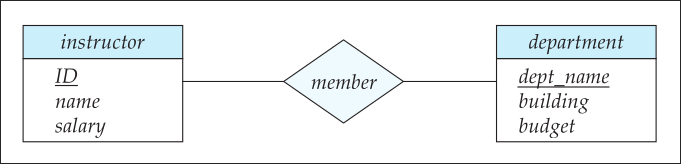

# Modelagem de Dados

Projeto descrito em aula / caderno

# Modelo Entidade-Relacionamento (ME-R)
Proposto por P. Chen em 1976.
- a intencao era amplificar a qualidade da modelagem, visto que os modelos anteriores eram incapazes de representar o volume de dados que estava sendo criado neste contexto.

__def__: Este modelo usa uma colecao de objetos basicos conhecidos como __entidades__, e representa o __relacionamento__ entre esses objetos. 

Neste contexto (1980), nao havia como representar dados de maneira concreta, entao foi uma das primeiras representacoes semanticas da realidade dentro de um sistema computacional (como pessoas, contas de banco e etc.).

Entidades sao descritas com um conjunto de __atributos__, como _nome_, _descricao_, etc. Podemos usar um _ID_ para identificar cada objeto.

Um relacionamento representa uma associacao entre diversas entidades. 

Tanto entidades como relacionamentos tem seus respectivos conjuntos (vale lembrar que um elemento do conjunto nao corresponde ao conjunto inteiro, ou seja: entidade (uma unica ocorrencia do conjunto) != conjunto de entidades), cuja logica estrutural pode ser (esquema/schema) representada graficamente com um diagrama _entidade-relacionamento_. Podemos usar a __UML - Unified Modeling Language__ para descrever esse esquema.

## Diagrama Entidade Relacionamento (DE-R)

__def:__ Representacao grafica das pecas logicas do Modelo Entidade-Relacionamento

- Conjunto de entidades sao representadas por retangulos com o nome em header e seus atributos listados. 
    - atributos: a descricao de um conjunto de entidades eh efetuada pelas caracteristicas  que sao relevantes, chamadas de atributos.
- Relacoes sao representadas por diamantes conectando um par de entidades.

__atributos__ podem ser (referentes aos componentes):
- (1) Simples - apenas um item 
    - exemplo: nome, ID, dept_name
- (2) Composto - mais de um item definindo
    - exemplo: endereco: cep, numero, rua

EX: 
- Instrutor: conjunto de entidades.
    - ID: atributo identificador
    - Name: atributo simples
    - Salario: atributo simples
- Departamento: conjunto de entidades.
    - dept_name: atributo identificador
    - building: atributo simples
    - budget: atributo simples
- member: relacionamento.

> exemplo 1.1 - desenho requerido pelo professor no meu caderno.

um atributo pode ser:
- univalorado: eh possivel assumir apenas um valor (representado por um traco e um circulo em sua ponta)
- multivalorado: eh possivel assumir varios valores (representado por um traco e um circulo com outra circunferencia menor em sua ponta)

> exemplo 1.2 - no caderno

# Busca de uma entidade em um conjunto de entidades

Desejamos buscar, de maneira unica, uma ocorrencia dentro do conjunto de entidades. Para tal, usaremos as chaves primarias para identificar cada entidade.

## Superchave
Uma colecao de atributos que, ao ser valorada, permite encontrar uma entidade dado um conjunto de entidades. ex: {Nome, RG}.

## Chave candidata
Uma superchave que nao possui nenhum subconjunto proprio como superchave. ex: {Nome} e {rg}.

## Chave Primaria
Uma das possiveis chaves candidatas escolhida pelo projetista. ex: {Rg}. Deve ser, portanto, o mais enxuta possivel.

