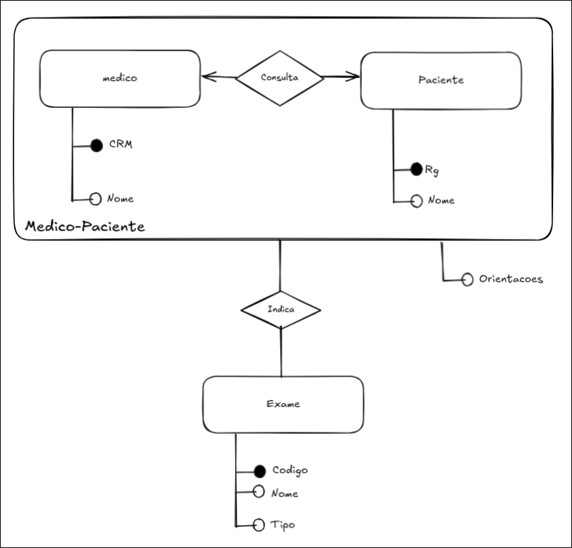
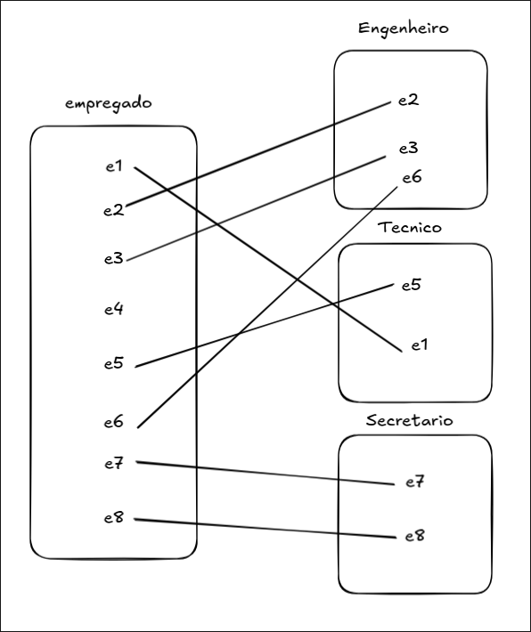
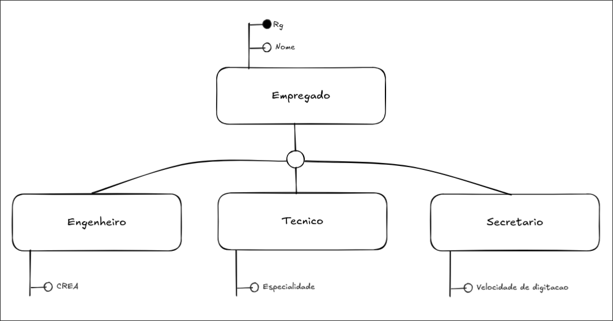
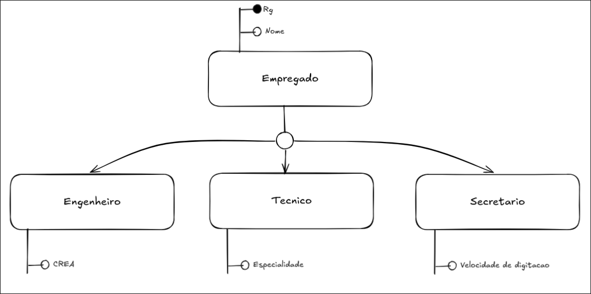
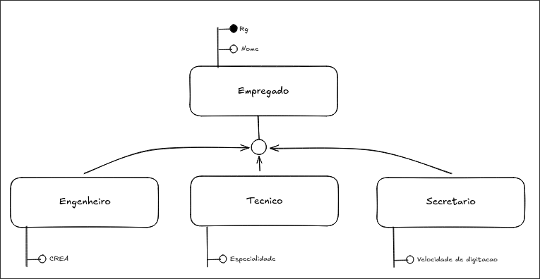
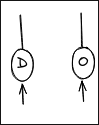
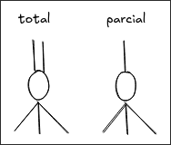
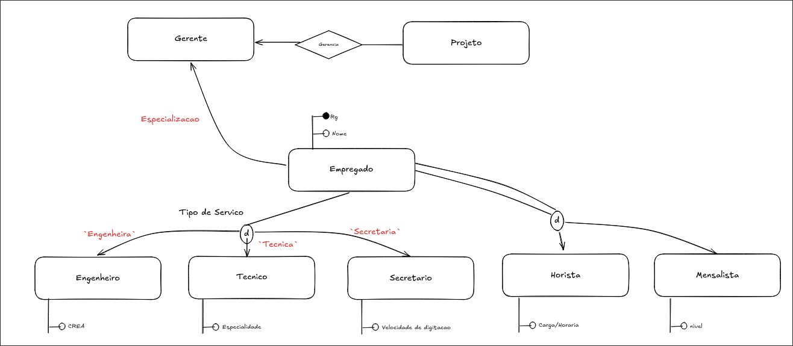

# Modelo Entidade-Relacionamento Estendido - (ME-RX)
Comecou a ser desenvolvido nos anos 80, atraves de contribuicoes externas a do autor Peter Scheins.

## Agregação
Abstração em nível superior na qual um conjunto de relacionamentos eh considerado como conjunto de entidades e, a partir dai, eh possível associar este ultimo a outro conjunto de relacionamentos.

> [!summary] Em resumo
>
> Permite-se especificar conjunto de relacionamentos associados a conjuntos de relacionamentos. 

A agregação pode, inclusive, ter atributos próprios (não necessariamente precisa de chave primaria, mas pode-se ter um atributo que compõe a chave primaria).

Neste exemplo, podemos considerar a entidade Medico-Paciente como um Conjunto de Entidades completo.

# Subclasse, superclasse e herança

__Superclasses:__ Conjunto de entidade que possuem atributos que sao passiveis de serem reusados em conjuntos que as herdam.
__Subclasses:__ Conjuntos de Entidade que herdam atributos em relacao a sua superclasse.
__Heranca:__ atributos que sao reaproveitaveis sao acessiveis da subclasse.

padrao: 

__especialização__: eh o processo de modelagem que permite obter as subclasses a partir da superclasse.

__Generalização__: processo de se obter a superclasse a partir da subclasse.

## Restrições
1. Disjunção (representada dentro do circulo de herança):  
	- Disjunta (D): se uma entidade pertence a uma subclasse, nao pode pertencer as demais.
	- sobreposta (O): uma entidade pode aparecer em 1 ou mais subclasses

2. Participação
	- total: toda entidade da superclasse tem que pertencer a, pelo menos, uma de suas subclasses.
	- parcial:  uma entidade da superclasse pode não pertencer a nenhuma de suas subclasses.

Exemplo completo: (em vermelho não precisa)

