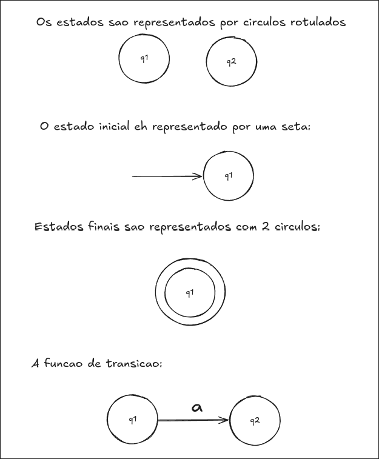

Um automato finito deterministico M é uma tupla:  

$$M = (Q, \Sigma, \delta, q_{0}, F)$$
---
$Q =$ Conjunto de estados
$\Sigma =$ Alfabeto de entrada
$\delta=$ funcao programa/funcao de transicao
$q_{0}=$ Estado Inicial ($q_{0}\in Q$)
$F =$ Estados finais ($F \subset Q$)

Um Automato Finito  tem 3 componentes essenciais:
- a) fita: unidade de entrada da cadeia, contem a informacao a ser processada pelo automato
- b) unidade de controle: reflete o estado corrente da maquina, possui uma unidade de leitura (cabeca de fita, a qual percorre serialmente a fita supracitada e interage com cada simbolo contido na cadeia)
- c) funcao programa: funcao que comanda a cabeca de leitura e os estados, ou seja, eh executado $n$ vezes pela unidade de controle.

## Iteracoes do Automato Finito Deterministico
1. cadeia eh escrita na fita
2. nao se escreve na fita apos o inicio da execucao da funcao programa
3. a cadeia ocupa a fita por inteiro
4.  nao ha memoria auxiliar, toda iteracao da um "flush" logico em toda informacao previamente carregada (e.g, o estado anterior se torna o atual, o simbolo anterior eh perdido e a cabeca, serialmente, avanca)

---
# Representacoes do automato finito

Ha tres tipos de representacao:
1) Formal
	- Automato: $M = (Q, \Sigma, \delta, q_{0}, F)$
	- transicao: $\delta: \{ \delta(q_{i}, a) = q_j\}$
	- Alfabeto: $\Sigma=\{a,b,c\}$
	- $Q = \{q_{1}, q_{2} \dots q_{n}\}$

2) Diagrama de estados

3) Tabela de transicao de estados

|                   | $v_0$    | $v_1$    | $\dots$  | $v_n$ |
| ----------------- | -------- | -------- | -------- | ----- |
| ->$q_0$           | $q_4$    | $q_1$    | $\vdots$ |       |
| $\underline{q_1}$ |          | $q_3$    | $\vdots$ |       |
| $\vdots$          | $\vdots$ | $\vdots$ | $\vdots$ |       |
| $q_n$             |          |          |          |       |
- estado inicial apontado por uma seta.
- estado final: underline
