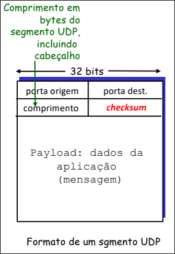

Eh papel da camada de Transporte fazer a ligação entre processos (sockets). Ela permite a aplicação enxergar os sistemas como se eles estivessem fisicamente conectados. 

Em contraponto a camada de redes (sera vista no próximo capitulo), que interliga hosts, esta camada interliga __processos__.

## Multiplexação
> [!done]
>
> Multiplexacao: MUX - DEMUX -> afunilar canais de transmissao em um grande "tubo" e conseguir identificar cada um deles na saida deste "tubo". 

No contexto da camada de transporte:
- Multiplexação: Juntar dados de múltiplos processos de aplicações envelopando dados com cabeçalho.

- Demultiplexação: entrega de segmentos recebidos para os processos da camada de aplicação corretos.

Neste caso, eh necessário que os 2 hosts saibam os protocolos envolvidos nesta troca.

# Os Protocolos de transporte
## UDP
Este protocolo eh consideravelmente simples, baseado em "melhor esforço".  não ha setup entre remetente e receptor, não ha status (stateless), sem confirmação de entrega, sem controle de congestionamento ou controle de fluxo.

Resulta em segmentos UDP:
- perdidos 
- entregues fora de ordem

Por que existe o UDP?

1. Elimina estabelecimento de conexao
    -> Reduz delay de "partida lenta"
2. Simples: stateless
3. Header pequeno
    -> Menos desperdicio de dados (overhead de 8 bytes (UDP) x 20 bytes (TCP))
4. Transmite sempre no seu limite.
5. Muito utilizado para aplicacoes de midia
    -> tolerantes a perdas
    -> sensíveis a taxa de transmissão
6. usado no DNS
7. A confiabilidade pode ser definida apenas na camada de aplicação.

### Calculo do Checksum (valido para TCP e UDP)
tem a finalidade de detectar falhas no segmento transmitido.

`Emissor:` 
1. Trata o segmento como sequencia de inteiros de 16-bits.
2. __Checksum__: Soma (usando complemento de 1) do segmento.
3. Para fazer o calculo: 
    1. Considera o campo checksu como zeros.
    2. inclui os dados (payload) - faz padding (para garantir numero par de blocos de 16bits)
    3. inclui um pseudoheader no calculo. (Dupla verificacao baseada na camada de redes)
4. Emissor coloca complemento de um do valor da soma no campo checksum de UDP com a soma invertida (0001 -> 1110).
5. envia o segmento

`receptor`:
1. Faz a soma e verifica se o valor resultado eh igual a 1.

> [!tip] checksum
>
> o RFC do UDP e o do TCP nao obrigam o uso do checksum
> isso eh feito para uso em sistemas na borda que nao sao muito poderosos.
> o indicador disso eh o checksum ser apenas 0's.

### Pseudo Header
TCP e UDP usam um pseudo header na camada IP no calculo checksum. 

> [!warning] 
>
> Viola o principio de independencia de camadas. 
> Feito para verificar qualidade dos dados em redes ruins.

