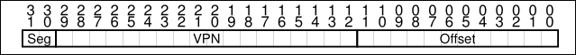

# tabelas de paginas (lineares) sao enormes
## solucao simples: aumentar cada pagina
podemos reduzir o tamanho simplesmente utilizando de paginas maiores. Se tivermos um address space de 32-bit, podemos usar um VPN de 18-bits e 14 bits para o offset. Assumindo que cada PTE tem 4 bytes, temos $2^{18}$ entries na page table linear. (total 1mb por page table).

Mesmo resolvendo parcialmente o problema, gera-se uma fragmentcao interna tremenda e, ainda assim, o resultado obtido em relacao a espaco nem eh tao satisfatorio.
 
## solucao hibrida: paginacao + segmentacao

Alteramos o registrador de base para guardar o endereco fisico da page table de cada segmento (cada segmento agora tem uma page table). O registrador de bounds agora armazena o final da page table.

O endereco virtual fica mais ou menos assim:



Entao, para conseguirmos o endreco do PTE (Page Table Entry), temos algo mais ou menos assim:

```c 
sn = (virtual_address & SEG_MASK) >> SN_SHIFT;
vpn = (virtual_address & VPN_MASK) >> VPN_SHIFT;
AddressOfPTE = Base[sn] + (vpn * sizeof(PTE))
```

A diferenca critica desta solucao esta na presenca de bounds por segmento. Cada reg de bounds guarda o valor maximo valido para acessar em cada segmento. 


## Multilevel Page-tables 

A ideia do page table multinivel eh transformar as page tables em uma estrutura similar a uma arvore. Primeiramente, precisamos separar a page table em paginas tambem, ou seja, uma pagina da page table tera varias PTE delimitadas por ela. 

Para verificarmos se uma pagina na page table eh valida ou nao, usaremos uma nova estrutura chamada de __page directory__. Esse diretorio tambem pode ser usado para indicar onde uma pagina esta. A principal diferenca eh que se uma page table entry eh invalida, ou seja, nao contem nada, nos simplesmente nao a alocamos. Isso diminui drasticamente o espaco ocupado. 

__Page Directory__: O diretorio de paginas eh uma estrutura simples, uma tabela de 2 niveis. Ela contem uma entrada por pagina da page table, que consiste num numero de __PDE (page directory entries)__. 

Um PDE eh, minimamente, constituido por um __valid bit__ e um __page frame number(PFN)__. O bit de validacao, aqui, apresenta outra funcao. Se o PDE eh valido, significa que pelo menos 1 das paginas da page table naquela entry apontam (via PFN) uma pagina valida. _Se o PDE eh invalido, ele nao eh alocado._

Se bem construida tambem, cada porcao da page table cabe ordenadamente dentro de uma pagina, sendo assim, o OS pode so pegar a proxima pagina livre para crescer a page table.

Com uma Multilevel Page table, podemos criar um __nivel de indirecao__, usando a page directory para apontar para regioes diferentes da memoria com custo de acesso de uma arvore. 

O unico "problema" desta estrutura eh a diminuicao da velocidade de acesso, que precisa de pelo menos 1 acesso a mais do que as linears page tables

### Traducao
o PDIndex esta presente nos n bits mais significativos do endereco virtual.

```c
PDEAddr = PageDirBase + (PDIndex * sizeof(PDE));
```
Se o PDE eh invalido, simplesmente geramos uma excessao e saimos.

Se o PDE for valido, precisa-se calcular o PTE (page table entry). Usamos o restante da VPN como _Page Table Index_ e conseguimos calcular o PTE por ai.

```c
PTEAddr = (PDE.PFN << SHIFT) + (PDIndex * sizeof(PTE));
```

A partir do PTE podemos conseguir o address fisico como visto anteriormente.

> Pode-se usar tambem mais de um diretorio na VPN, e.g: usar PD Index 0 e PD Index 1

### Flow de acesso a memoria
```c
VPN = (VirtualAddress & VPN_MASK) >> SHIFT;
(Success, TlbEntry) = TLB_Lookup(VPN);
if (Success == True) {// TLB Hit
    if (CanAccess(TlbEntry.ProtectBits) == True) {
        Offset = VirtualAddress & OFFSET_MASK;
        PhysAddr = (TlbEntry.PFN << SHIFT) | Offset;
        Register = AccessMemory(PhysAddr);
    }

    else {
        RaiseException(PROTECTION_FAULT);
    }
}
else {// TLB Miss
    // first, get page directory entry
    PDIndex = (VPN & PD_MASK) >> PD_SHIFT;
    PDEAddr = PDBR + (PDIndex * sizeof(PDE));
    PDE = AccessMemory(PDEAddr);
    if (PDE.Valid == False) {
        RaiseException(SEGMENTATION_FAULT)
    }
    else {
        // PDE is valid: now fetch PTE from page table
        PTIndex = (VPN & PT_MASK) >> PT_SHIFT;
        PTEAddr = (PDE.PFN<<SHIFT) + (PTIndex*sizeof(PTE));
        PTE = AccessMemory(PTEAddr);
        if (PTE.Valid == False)
            RaiseException(SEGMENTATION_FAULT);
        else if (CanAccess(PTE.ProtectBits) == False)
            RaiseException(PROTECTION_FAULT);
        else {
            TLB_Insert(VPN, PTE.PFN, PTE.ProtectBits)
            RetryInstruction()
        }
    }
}
```

## Page-tables invertidas

## Swapping
